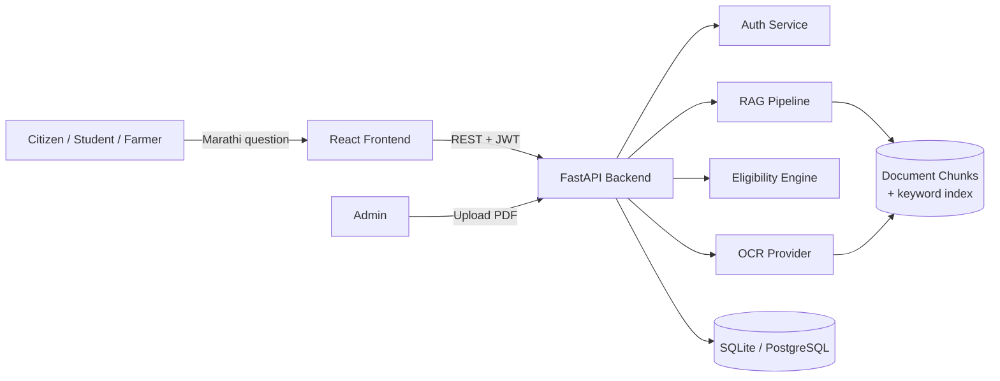

# Architecture

## System overview



## Document pipeline

```mermaid
flowchart TD
    A[PDF Upload] --> B{Has embedded text?}
    B -->|Yes| C[PyMuPDF text extraction]
    B -->|No / scanned| D[Demo OCR fallback\n(clearly labelled)]
    C --> E[Clean text]
    D --> E
    E --> F[Chunk text]
    F --> G[Extract keywords]
    G --> H[(DocumentChunk table)]
```

## RAG pipeline (demo mode)

```mermaid
flowchart TD
    Q[User question] --> N[Normalize + extract keywords]
    N --> S[Score all published chunks\nby keyword overlap]
    S --> T[Take top-k chunks]
    T --> C{Any evidence found?}
    C -->|No| X["मला पुरेसे पुरावे सापडले नाहीत" response]
    C -->|Yes| R[Build context from top chunks]
    R --> RW[Readability rewrite\n(level 1-4, preserves numbers/dates)]
    RW --> CIT[Attach citations: doc, dept, page]
    CIT --> CONF[Confidence score from top match]
    CONF --> OUT[ChatResponse]
```

## Why keyword retrieval instead of pgvector, in this MVP

The full spec calls for pgvector + multilingual embeddings. That's the right call for a
real deployment, but it adds a heavy dependency (an embedding model, GPU/CPU cost, vector
index tuning) that isn't needed to demonstrate the *pattern* — retrieve-then-generate,
with citations, is what actually matters for the readability/hallucination-control story
this project is about. `services/rag.py::hybrid_search` is written so a semantic score can
be added alongside the keyword score without changing any caller:

```python
score = 0.6 * semantic_similarity(query_vec, chunk_vec) + 0.4 * keyword_score(...)
```

## Eligibility engine

Deliberately rule-based, not LLM-based — every criterion (age/income/category/occupation)
is evaluated independently and the result is conservative: any `NOT_MATCH` wins over
`MATCH`, any `UNKNOWN` (missing user data) wins over `MATCH`. This makes every result
explainable, which matters both for user trust and for your viva defense of "why not just
ask the LLM".
